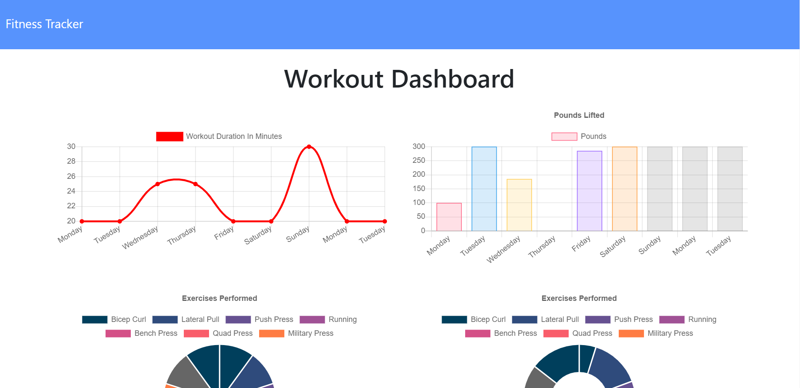

# Fitness_Tracker

## Description
An application that allows the user to create and track daily workouts. It utilizes a Mongo database with a Mongoose schema, and handles routes with Express.

As a user, view, create, and track daily workouts. Each workout is a model, containing an exercise property of datatype array containing exercise objects. A single workout model can contain several exercises. Visiting the page gives the user the option to create a new workout, or continue with their last workout. The most recent workout loads by default. The user then adds exercises to the most recent workout, or a new workout. The dashboard displays the combined weight of multiple exercises, and the total duration of each workout from the past seven days.

**[Get fit here.](https://drive.google.com/file/d/1-Z7d5IIzcBIHGZ7wPe0pSHVjXTYoZc7j/view)**

To calculate totals, Mongodb aggregation is used. Both the $addFields, and $sum operators are utilized to calculate the total workout duration. The application is hosted by Heroku.

## Table of Contents
* [Usage](#usage)
* [Credits](#credits)
* [License](#license)

## Usage
* **The Finished Product**  

## Credits
Here are a few resources that helped me get this project knocked out!
* [Stack Overflow: Mongodb aggregation](https://stackoverflow.com/questions/34118631/sum-array-elements-in-mongodb-aggregation)
* [Mongodb Documentation: $sum aggregation](https://docs.mongodb.com/manual/reference/operator/aggregation/sum/)
* [Mongodb Documentation: $addFields aggregation](https://docs.mongodb.com/manual/reference/operator/aggregation/addFields/)
* [MDN Array.prototype.reduce()](https://developer.mozilla.org/en-US/docs/Web/JavaScript/Reference/Global_Objects/Array/Reduce)
* [Stack Overflow: sum array of numbers](https://stackoverflow.com/questions/1230233/how-to-find-the-sum-of-an-array-of-numbers)

## License
* Link for more information: (https://opensource.org/licenses/MIT)
* MIT License

      Copyright (c) [2021] [Richard A Seward]
      
      Permission is hereby granted, free of charge, to any person obtaining a copy
      of this software and associated documentation files (the "Software"), to deal
      in the Software without restriction, including without limitation the rights
      to use, copy, modify, merge, publish, distribute, sublicense, and/or sell
      copies of the Software, and to permit persons to whom the Software is
      furnished to do so, subject to the following conditions:
      
      The above copyright notice and this permission notice shall be included in all
      copies or substantial portions of the Software.
      
      THE SOFTWARE IS PROVIDED "AS IS", WITHOUT WARRANTY OF ANY KIND, EXPRESS OR
      IMPLIED, INCLUDING BUT NOT LIMITED TO THE WARRANTIES OF MERCHANTABILITY,
      FITNESS FOR A PARTICULAR PURPOSE AND NONINFRINGEMENT. IN NO EVENT SHALL THE
      AUTHORS OR COPYRIGHT HOLDERS BE LIABLE FOR ANY CLAIM, DAMAGES OR OTHER
      LIABILITY, WHETHER IN AN ACTION OF CONTRACT, TORT OR OTHERWISE, ARISING FROM,
      OUT OF OR IN CONNECTION WITH THE SOFTWARE OR THE USE OR OTHER DEALINGS IN THE
      SOFTWARE.
